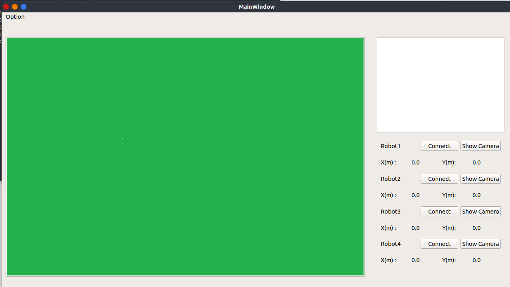

# Script Introduction
* This is a control panel used to track the position of robots and balls seen by the robots.  
* In theory, you can add as many robots as possibile. However, as the rule only allows 4 robots in field, I just add 4 buttons to add 4 robots to be tracked. Feel free to modify it to suit your requirement  

# TODO
- [ ] Add camera image transferred by the chosen robot.  
- [ ] Add interactive click experience on connection buttons.  

# Usage
## ui_convertor.sh
* There is a script called **ui_convertor.sh** inside **/scripts/**. It is used to convert a **.ui** file created by Qt Designer into a **.py** file.  
* Just run `./ui_convertor.sh` in command line. It will prompts some questions about the source and destination about the converting. Default `src` is `../resources/TempWindow.ui` and default `dst` is `../src/behavior_monitor/TempWindow.py`.
* It is actually a firendly file using **pyuic5**. So be sure to have **pyuic5** first. Just run `pyuic5` in command line.  
    * If it shows `Error: one input ui-file must be specified`, then the `ui_convertor.sh` should work fine.  
    * If it shows some other things, it means that you do not have **pyuic5**. Just run the following commands first, then you will have pyuic5 successfully installed.  
        * `sudo apt update`  
        * `sudo apt install pyqt5-dev-tools`  
## behavior_monitor
* This is a **Python** file located in **/scripts/** folder.  
* Just run the following lines to make the window shown as the picture below.  
    * `roscore`  
    * `rosun behavior_monitor behavior_monitor`  
* Please be sure to have PyQt5 installed on your machine. If not, please run the following command line first. Click [here](https://build-system.fman.io/pyqt5-tutorial) for a good beginning tutorial on PyQt5.  
    * `pip install PyQt`  

# Technical Details
* Every time you click on the button to connect a certain robot, the main window will create a ROS subscriber on topic **/robot#/pos**. Here **#** is the number of the robot.  
* The detail of topic **/robot#/pos** is given below.
    * Type: std_msgs.msg.String
    * Content: **JSON** encoding string =  `dict` in **Python**
        * 'name'    : 'robot#' (# is the number of the robot)
        * 'pos'     : a `dict` in **Python**
            * 'x'   : x axis position of the robot
            * 'y'   : y axis position of the robot
        * 'ballpos' : a `dict` in **Python**
            * 'x'   : x axis position of the ball seen by the robot
            * 'y'   : y axis position of the ball seen by the robot
 
